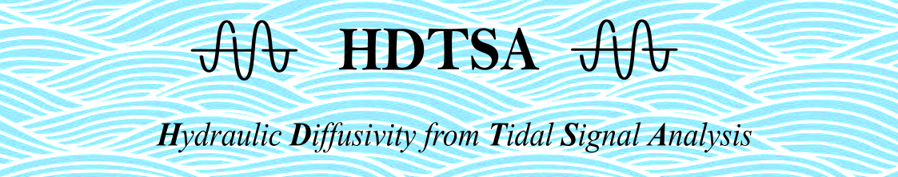
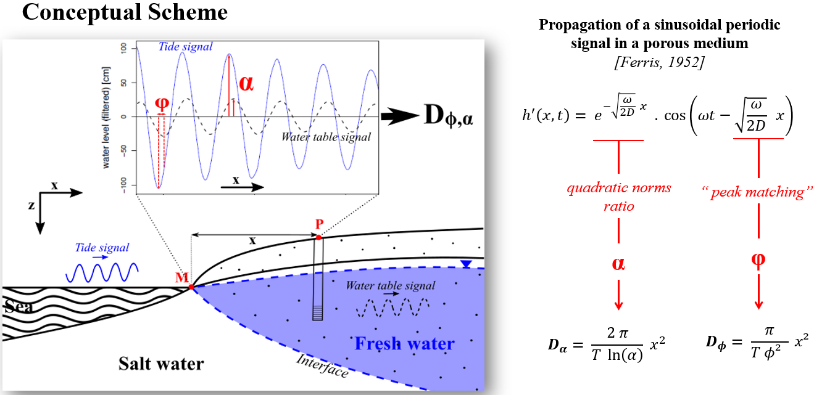

<h1 align="center">

</h1>


[](https://github.com)
[](https://www.python.org/)
[](https://github.com/Naereen/badges/)
[](https://github.com/Naereen/badges)

<br>

Description
-----------------------------------------------
Simple functions to compute 1D-_Ferris_ equations from sinusoidal periodic signal propagation in a porous medium.


Installation
------------------------------------------------
To install the current version:

```shell
git clone https://github.com/pmatran/hdtsa.git
cd hdtsa
```

Make sure to install all dependencies:

```shell
pip install -r requirements.txt
```

As a test, you can run the provided `example.py`:

```shell
python example.py [-s]
```


Context
-----------------------------------------------
Conceptually, a tidal signal is defined by a periodic signal that propagates in a relatively homogeneous medium : the seawater. Reaching the costline (**M**) the tidal signal continues to spread in the coastal aquifer. Nevertheless, the costal aquifer is a more complex medium that contains 2 phasis: solid (_rock_) and liquid/fluide (_water_).

<br>
<p align="center">

</p>
<br>

Therefore, the signal will be affected by 2 phenomenons:
- Attenuation **($\alpha$)**
- Phase shift **($\alpha$)**

Extracting the sea levels at the costline (**M**) thank's to tide gauges records and analyzing the water table records of a given observation well (**P**) `x`  meters away from the costline during the same time window, it is possible to access the values of the attenuation and phase shift:


| Parameter   | Variable | Unit | Method                | Equation                        |
|-------------|----------|------|-----------------------|---------------------------------|
| Attenuation | $\alpha$ | [-]  | Quadratic Norms Ratio | $\exp{-sqrt(\omega \over 2D)x}$ |
| Phase shift | $\phi$   | [T]  | Peak matching         | $\sqrt{\omega \over 2D}x$       |


Finally, the 1D propagation equation of a sinusoidal periodic signal in porous media proposed by [Ferris,1952](https://pubs.er.usgs.gov/publication/70133368) links the calculated $\alpha$ and $\phi$ parameters to the hydraulic diffusivity of the costal aquifer, respectivly, $D_{\alpha}$, $D_{\phi}$.


Get started
-----------------------------------------------

```python
# ---- Import modules
import numpy as np
from ferris import attenuation2hd, shift2hd

# ---- Set some observation values
alpha, phi, xc, T = [0.493, 0.333, 371, 1.2e-3]

# ---- Compute hydraulic diffusivities
hd_alpha = attenuation2hd(alpha=alpha, x=xc, T=T)
hd_phi = shift2hd(phi=phi, x=xc, T=T)

# ---- Copute `slope factor` criteria
slope_factor = np.sqrt(hd_alpha/hd_phi)
print(f"Slope factor = {round(slope_factor, 3)}")

```


Contributing
------------------------------------------------
Bug reports, code contributions, or improvements to the documentation are welcome from the community. 
Feel free to suggest improvements by working with your own fork version of `hdtsa`. Go to the project page and hit the **Fork** button.
You will want to clone your fork to your machine:

```shell
git clone <url_hdtsa> <hdtsa-yourname>
cd hdtsa-yourname
```


Ressources
-----------------------------------------------
+ [Determining aquifer characteristics by the tidal method](https://agupubs.onlinelibrary.wiley.com/doi/abs/10.1029/WR005i005p01023).
+ [Cyclic fluctuations of water level as a basis for determining aquifer transmissibility](https://pubs.er.usgs.gov/publication/70133368)
+ [Hydrogéologie des milieux volcaniques insulaires: apports d'une étude intégrée aux îles Galapagos](https://tel.archives-ouvertes.fr/tel-00747313)


:no_entry: Disclaimer :no_entry:
-----------------------------------------------
:arrow_right:This project was created to evaluate `git` management skills of the owner ([@pmatran](https://github.com/pmatran)) by his professor at M2-IAScool (Bordeaux, FRANCE).
<br>
:arrow_right:However, remember that the provided data are not totally fake and comes from a previous student work proposed by [@apryet](https://github.com/apryet) at ENSEGID school (Bordeaux, FRANCE).
